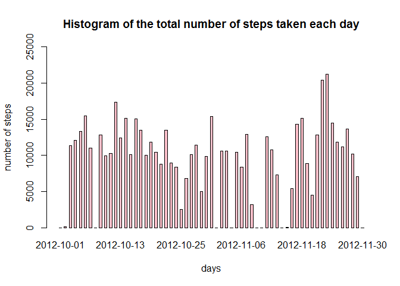
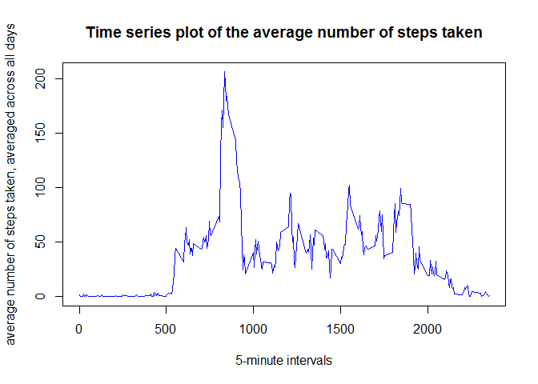
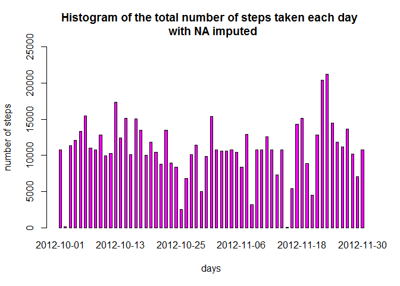
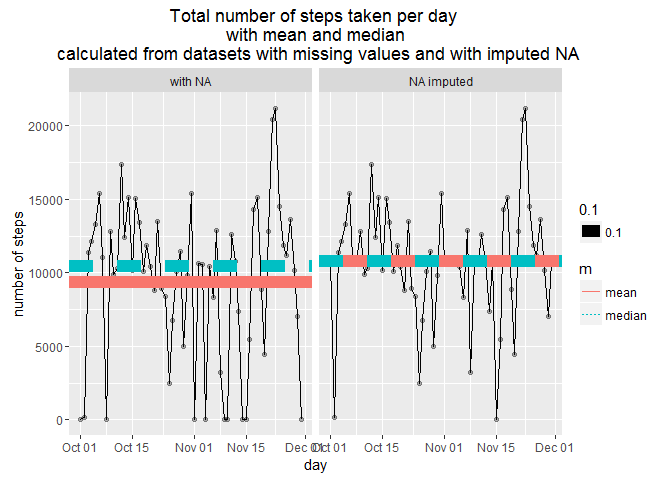
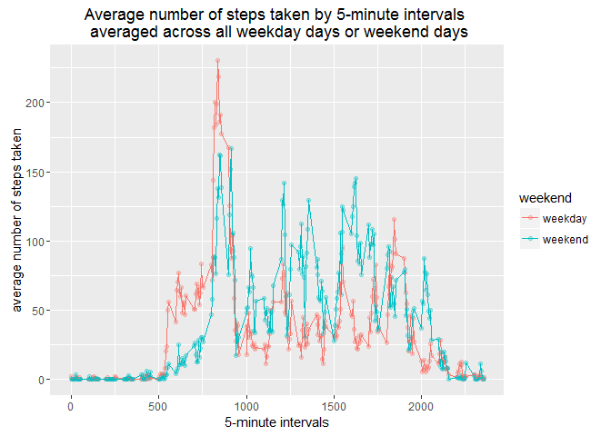

# Course project #1. Reproducible Research.
Svetlana Tabulina


## Introduction

This assignment makes use of data from a personal activity monitoring device. This device collects data at 5 minute intervals through out the day. The data consists of two months of data from an anonymous individual collected during the months of October and November, 2012 and include the number of steps taken in 5 minute intervals each day.

The data for this assignment can be downloaded from the course web site: 
[Activity monitoring data](https://d396qusza40orc.cloudfront.net/repdata%2Fdata%2Factivity.zip)


## Loading and preprocessing the data
At the very beginning lets load R libraries needed.


```r
library(dplyr)
library(ggplot2)
Sys.setlocale('LC_ALL', 'english')
require(foreign)
```

First step of the analysis is to load the data and transform the date column into a Date format.
The code is:


```r
a<-read.csv(file=unz("activity.zip","activity.csv"),header=TRUE,sep=",",stringsAsFactors = FALSE)
a$date<- as.Date(a$date,"%Y-%m-%d")
tbl_df(a)
```

```
## # A tibble: 17,568 x 3
##    steps       date interval
##    <int>     <date>    <int>
## 1     NA 2012-10-01        0
## 2     NA 2012-10-01        5
## 3     NA 2012-10-01       10
## 4     NA 2012-10-01       15
## 5     NA 2012-10-01       20
## 6     NA 2012-10-01       25
## 7     NA 2012-10-01       30
## 8     NA 2012-10-01       35
## 9     NA 2012-10-01       40
## 10    NA 2012-10-01       45
## # ... with 17,558 more rows
```

AS we can see, the variables included in this dataset are:

1. steps: Number of steps taking in a 5-minute interval (missing values are coded as NA)
2. date: The date on which the measurement was taken in YYYY-MM-DD format
3. interval: Identifier for the 5-minute interval in which measurement was taken

and there are a total of 17,568 observations in this dataset


##What is mean total number of steps taken per day?

Calculate the total number of steps taken per day (ignore the missing values). And make a histogram of the total number of steps taken each day.


```r
number.steps.per.day<-tapply(a$steps,as.factor(a$date),sum,na.rm=TRUE)
barplot(number.steps.per.day, space=1, 
        main="Histogram of the total number of steps taken each day",
        xlab="days",ylab="number of steps", 
        ylim=c(0,25000), col="pink")
```



Calculate and report the mean and median of the total number of steps taken per day


```r
print(summary(number.steps.per.day),type="html")
```

```
##    Min. 1st Qu.  Median    Mean 3rd Qu.    Max. 
##       0    6778   10400    9354   12810   21190
```


##What is the average daily activity pattern?

Make a time series plot of the 5-minute interval (x-axis) and the average number of steps taken, averaged across all days (y-axis)


```r
average.per.interval<-tapply(a$steps,as.factor(a$interval),mean,na.rm=TRUE)
intervals<-as.numeric(names(average.per.interval))
plot(intervals,average.per.interval, type = "l",col="blue",
     main="Time series plot of the average number of steps taken",
     xlab="5-minute intervals",ylab="average number of steps taken, averaged across all days")
```




Which 5-minute interval, on average across all the days in the dataset, contains the maximum number of steps


```r
print(data.frame(name=
  c("5-minute interval","maximum  average number of steps"), value=c(names(which.max(average.per.interval)),
                                                               round(as.numeric(average.per.interval[which.max(average.per.interval)]))
                                                                     )),
                                                               type="html")
```

```
##                               name value
## 1                5-minute interval   835
## 2 maximum  average number of steps   206
```


##Imputing missing values

Calculate and report the total number of missing values in the dataset (i.e. the total number of rows with NAs)


```r
sum(is.na(a$steps))
```

```
## [1] 2304
```

Strategy for filling in all of the missing values is the mean for that 5-minute interval.
Create a new dataset that is equal to the original dataset but with the missing data filled in.
Make a histogram of the total number of steps taken each day


```r
impute.na <- a %>%
  group_by(as.factor(a$interval)) %>%
  mutate(steps = ifelse(is.na(steps), round(mean(steps, na.rm = T)), steps))


number.steps.per.day.na.imputed<-tapply(impute.na$steps,as.factor(impute.na$date),sum,na.rm=TRUE)

barplot(number.steps.per.day.na.imputed, space=1, 
        main="Histogram of the total number of steps taken each day \n with NA imputed",
        xlab="days",ylab="number of steps", 
        ylim=c(0,25000), col="magenta")
```



Calculate and report the mean and median total number of steps taken per day


```r
summary(number.steps.per.day.na.imputed)
```

```
##    Min. 1st Qu.  Median    Mean 3rd Qu.    Max. 
##      41    9819   10760   10770   12810   21190
```

Do these values differ from the estimates from the first part of the assignment? What is the impact of imputing missing data on the estimates of the total daily number of steps?


```r
number.steps.per.day.df<-data.frame(value=number.steps.per.day,
                                    date=as.Date(names(number.steps.per.day),"%Y-%m-%d"),
                                    isna=rep("with NA",length=length(number.steps.per.day)))

number.steps.per.day.na.imputed.df<-data.frame(value=number.steps.per.day.na.imputed,
                                    date=as.Date(names(number.steps.per.day.na.imputed),"%Y-%m-%d"),
                                    isna=rep("NA imputed",length=length(number.steps.per.day.na.imputed)))

df.to.plot<-rbind(number.steps.per.day.df,number.steps.per.day.na.imputed.df)

mean.and.median<-data.frame(m=c("mean","median","mean","median"),
                            isna=c("with NA","with NA","NA imputed","NA imputed"),
                            value=c(mean(number.steps.per.day),median(number.steps.per.day),
                                    mean(number.steps.per.day.na.imputed),
                                         median(number.steps.per.day.na.imputed)))


ggplot(data = df.to.plot, aes(x=date, y=value)) + 
  geom_point(alpha=.3) + geom_line() +
  geom_hline(aes(yintercept = value, colour = m,lty=m,size=.1), mean.and.median) +
  facet_wrap(~ isna) +
  ggtitle("Total number of steps taken per day \n with mean and median \n calculated from datasets with missing values and with imputed NA") +
  labs(x="day",y="number of steps")
```




##Are there differences in activity patterns between weekdays and weekends?

Create a new factor variable in the dataset with two levels – “weekday” and “weekend” indicating whether a given date is a weekday or weekend day


```r
impute.na <- impute.na %>% 
  mutate(weekend=ifelse(weekdays(date) %in% c("Saturday","Sunday"), "weekend","weekday"),
         day=weekdays(date))
dim(impute.na)
```

```
## [1] 17568     6
```

```r
unique(impute.na$day)
```

```
## [1] "Monday"    "Tuesday"   "Wednesday" "Thursday"  "Friday"    "Saturday" 
## [7] "Sunday"
```

```r
unique(impute.na$weekend)
```

```
## [1] "weekday" "weekend"
```

Make a panel plot containing a time series plot of the 5-minute interval (x-axis) and the average number of steps taken, averaged across all weekday days or weekend days (y-axis).


```r
average.weekday <- impute.na %>%
  group_by(weekend, interval) %>%
  summarise(m=mean(steps))

unique(average.weekday$weekend)
```

```
## [1] "weekday" "weekend"
```

```r
ggplot(data = average.weekday, aes(x=interval, y=m, col=weekend)) + 
  geom_point(alpha=.3) + geom_line() +
  ggtitle("Average number of steps taken by 5-minute intervals \n averaged across all weekday days or weekend days") +
  labs(x="5-minute intervals",y="average number of steps taken")
```



